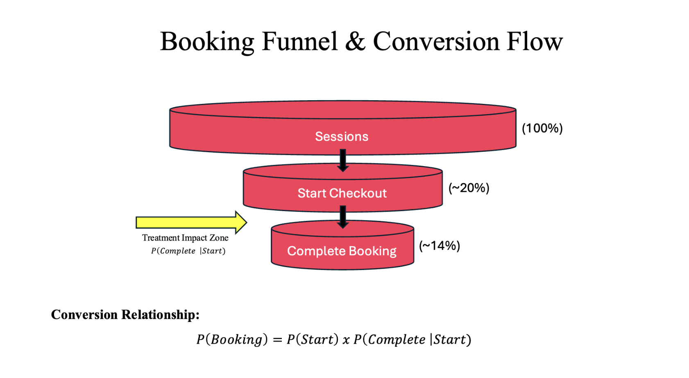
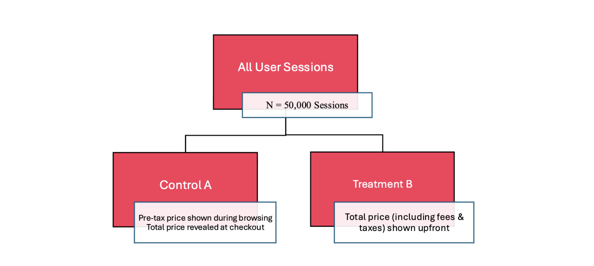
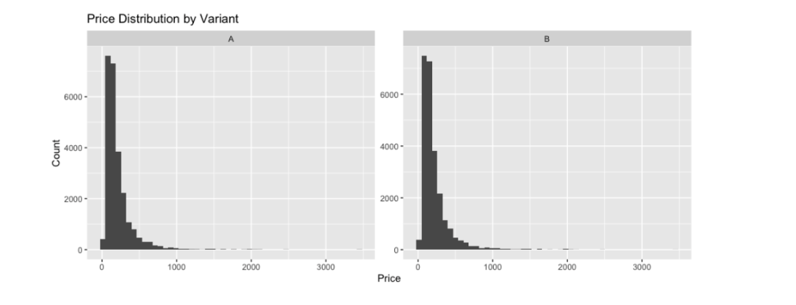
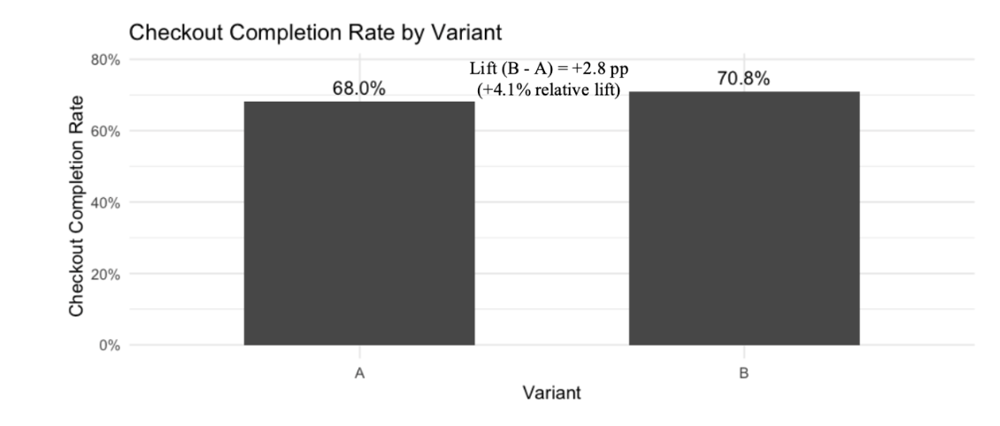

# Airbnb Price Transparency A/B Test

An A/B test evaluating whether showing the full price upfront, instead of a pre-tax price revealed later at checkout, improves booking conversion on Airbnb's New Orleans market. Built in R with simulated user sessions, hypothesis testing, and a confirmatory logistic regression.

Pipeline: Simulate 50,000 randomized sessions -> Split into Control/Treatment -> Validate randomization -> Run proportion z-tests -> Confirm with logistic regression -> Business recommendation

## Why this project

Users initially see a pre-tax price when browsing Airbnb listings, with the full price (including fees and taxes) only revealed later during checkout. That gap between the browsing price and the checkout price can cause price surprise, increased friction, checkout abandonment, and reduced trust, all of which cost bookings without anyone necessarily noticing why.

This project tests that assumption directly rather than assuming it: does showing the full price upfront actually change whether someone completes checkout, or does the pre-tax price not matter as much as it seems like it should?

## How it works

1. **Prerequisites.** R (with `readr`, `dplyr`, `ggplot2`, `stringr` installed).
2. **Get the code.** Clone or download this repository.
3. **Get the data.** Download the dataset from Kaggle, unzip it, and place `new_orleans_airbnb_listings.csv` in the `data/` folder (see [Dataset](#dataset) below).
4. **Run it:**

   ```bash
   Rscript scripts/ab_testing_analysis.R
   ```

Under the hood, the script runs through the same steps every time:

- **Simulate**: 50,000 user sessions are randomly split into two variants, a Control (A) that shows the pre-tax price during browsing and reveals the full price at checkout, and a Treatment (B) that shows the full price, including fees and taxes, upfront. Checkout initiation probability is simulated from real listing characteristics (price, rating, superhost status, instant booking availability), with the Treatment group given a simulated +2 percentage point bump in booking completion probability.
- **Validate randomization**: a chi-squared test checks that the Control/Treatment split and price distributions are balanced, confirming the two groups are actually comparable before drawing any conclusions from them.
- **Test the hypothesis**: one-sided two-proportion z-tests compare checkout completion rate and overall booking conversion between the two groups.
- **Confirm with regression**: a multivariable logistic regression re-tests the treatment effect while controlling for price, rating, superhost status, and instant booking, to rule out the lift being explained by listing differences rather than the price-display change itself.

## Hypothesis

**Null hypothesis:** showing the full price upfront does not change checkout completion compared to the pre-tax price.

`P(Complete | Start, Full Price) <= P(Complete | Start, Pre-Tax Price)`

**Alternate hypothesis:** showing the full price upfront increases checkout completion compared to the pre-tax price.

`P(Complete | Start, Full Price) > P(Complete | Start, Pre-Tax Price)`

## Key metrics



- **Booking funnel**: `P(Booking) = P(Start) x P(Complete | Start)`. Of all sessions, ~20% start checkout and ~14% complete a booking; the treatment is designed to act specifically on the `P(Complete | Start)` step, shown above as the Treatment Impact Zone.
- **Primary metric, checkout completion rate** = `P(Complete | Start Checkout)`, the probability a user completes booking given that they started checkout.
- **Secondary metric, overall booking conversion** = the share of all sessions that end in a completed booking.
- **Randomization check**: a chi-squared test on the Control/Treatment sample split and price distributions, used to confirm the split was actually random before comparing the groups.
- **Significance tests**: one-sided two-proportion z-tests on both metrics, followed by a logistic regression controlling for listing characteristics as a robustness check.

## Experimental design



50,000 total user sessions, randomly split into two variants:

- **Control (A):** pre-tax price shown during browsing, total price revealed at checkout
- **Treatment (B):** total price, including fees and taxes, shown upfront

## Results

**Randomization check:**



Control (A) got 25,093 sessions, Treatment (B) got 24,907, with a chi-squared test p-value of 0.405. The even split and similar price distributions across both groups, shown above, confirm randomization worked as intended.

**Primary metric, checkout completion rate:**



| | Control (A) | Treatment (B) | Lift |
|---|---|---|---|
| Checkout completion rate | 68.0% | 70.8% | +2.8 pp (+4.1% relative) |

**Secondary metric, overall booking conversion:**

| | Control (A) | Treatment (B) | Lift |
|---|---|---|---|
| Overall booking conversion | 13.7% | 14.5% | +0.8 pp (+5.8% relative) |

**Statistical validation:**

| Metric | Test | p-value |
|---|---|---|
| Checkout completion rate | One-sided two-proportion z-test | 0.0012 |
| Overall booking conversion | One-sided two-proportion z-test | 0.0075 |

**Regression confirmation:** a logistic regression on completed booking, controlling for price, rating, superhost status, and instant book, still finds the treatment effect statistically significant (p = 0.002).

**Takeaway:** the lift shows up on both the primary and secondary metric, survives a randomization check, and survives being re-tested with listing characteristics controlled for. That last part matters most: it's what rules out the alternative explanation that Treatment sessions just happened to land on cheaper or better-rated listings. Because the effect holds up after controls, the more likely explanation left standing is the one being tested: showing the full price upfront helps people push through checkout rather than getting surprised by it.

## Business recommendation

**Recommendation:** standardize full price transparency across the platform.

**Expected impact:** a +0.8 percentage point increase in overall booking conversion (~5.8% relative lift), improved user trust and pricing transparency, and incremental revenue growth that compounds at platform scale even from a modest per-session gain.

**Risk assessment:** no negative impact on booking behavior was detected, and the lift remains significant after controlling for listing characteristics.

Rollout is recommended in the New Orleans market, with further testing across additional markets before broader deployment, since a single-market result doesn't guarantee the same effect holds where listing mix, price sensitivity, or user behavior differ.

## Known limitations

- **Simulated, not observed, checkout behavior.** Checkout initiation and the Treatment's effect on completion are simulated from listing characteristics, not measured from real Airbnb session logs, so the results describe what the model assumes about user behavior, not a guarantee of what would happen in a live rollout.
- **Single market.** All 50,000 sessions are New Orleans listings; the effect hasn't been tested against a market with a different price range, listing mix, or user base.
- **No automated tests.** Nothing checks the simulation or statistical calculations automatically; correctness relies on the results matching expectations on manual review.

## Future work

- Re-run the same test design against real session-level data, if and when it's available, to check whether the simulated effect size holds up against actual user behavior.
- Extend the test to additional markets beyond New Orleans to see whether the lift generalizes or is market-specific.
- Segment the treatment effect by listing type, price tier, or guest type, to see whether some segments respond more than others rather than assuming a uniform effect.

## Dataset

**Source:** [New Orleans Airbnb Listings and Reviews](https://www.kaggle.com/datasets/ruthgn/new-orleans-airbnb-listings-and-reviews) (Kaggle). **Granularity:** one record per listing, used to simulate 50,000 user sessions.

Dataset not included in this repo due to Kaggle licensing restrictions. To reproduce:

- Download the dataset from Kaggle and unzip it
- Place `new_orleans_airbnb_listings.csv` in the `data/` folder
- Run `scripts/ab_testing_analysis.R`

## Project structure

```
.
├── scripts/
│   └── ab_testing_analysis.R   # Simulation, A/B test, and regression
├── data/
│   └── README.md               # Dataset download instructions
├── screenshots/
│   ├── funnel.png
│   ├── design.png
│   ├── groups.png
│   └── results.png
└── README.md
```

## Tech stack

R, dplyr, ggplot2, hypothesis testing (two-sample proportion tests), chi-squared test, logistic regression.

## Author

**Isaiah Lacet**
